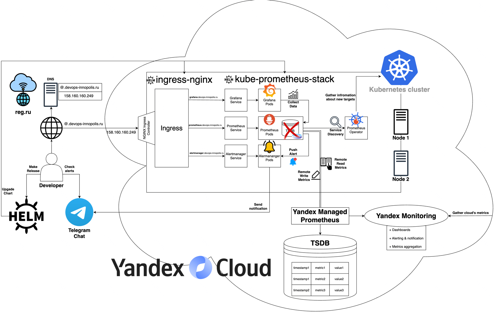

# monitoring-project
> Innopolis University DevOps project with configuring monitoring of the K8S cluster inside Yandex Cloud.

## 📝 Project Description

Our project configures comprehensive monitoring of an infrastructure inside
the Kubernetes cluster in the Yandex Cloud.

### ⚙️ Tools Used

#### Configuration
- [Kubernetes](https://kubernetes.io/): Container orchestration platform for deploying, scaling, and managing applications.
- [Yandex Cloud](https://yandex.cloud/en): Cloud platform providing managed Kubernetes services and other infrastructure solutions.
    - Yandex Managed K8S
    - Yandex Managed Prometheus (including custom `kube-prometheus-stack` helm chart)
    - Yandex Load Balancer (including custom `ingress-nginx` helm chart)
- [Helm](https://helm.sh/):  Package manager for Kubernetes to automate deployments.

#### Tools
- [Prometheus](https://prometheus.io/): Collects and stores time-series data for monitoring.
- [Grafana](https://grafana.com/): Visualization tool for building dashboards from Prometheus metrics.
- [Telegram](https://telegram.org/): Used for real-time alerts and notifications.  
- [kube-prometheus-stack](https://github.com/prometheus-community/helm-charts/tree/main/charts/kube-prometheus-stack): Helm chart provided by Yandex Cloud for seamless integration with Yandex Managed Prometheus.
- [ingress-nginx](https://kubernetes.github.io/ingress-nginx/): Used for managing access to services within the Kubernetes cluster.

### 📦 Architecture

The overview architecture of our monitoring infrastructure is below:


You can also find it in an interactive scalable format opening HTML file in your browser:
[docs/arch/iu_devops_architecture.html](docs/arch/iu_devops_architecture.html).
This document was created with the use of https://draw.io

Let us briefly explain the components:
- **Developer** is a developer of the monitoring infrastructure.
- **`@devops-innopolis.ru`** is the domain name to access our resources. We put DNS record publicly available using https://reg.ru.
- **Ingress** is created to make our resources publicly available using public IPv4. **NGINX Ingress Controller** is used to support K8S Ingress.
- The ingress leads to 3 different K8S Services: **Grafana**, **Prometheus**, **Alertmanager**.
- These services lead to the proper K8S **Pods**.
- **Prometheus Pods** scrape metrics from K8S cluster targets and (instead of storing them locally) writes them to the **Yandex Managed Prometheus**.
- **Grafana Pods** collects metrics from **Prometheus Pods** as a datasource.
- **Alertmanager Pods** obtains alerts from the **Prometheus Pods**.
- **Prometheus Operator Pods** are used as a Service Discovery for the Prometheus to discover K8S cluster targets (K8S entities, Prometheus itself, nodes, etc.)
- **Nodes**: our K8S cluster consists of two nodes.
- **Yandex Managed Prometheus** stores our metrics aggregating them over different Prometheus instances (VMs, several clusters, etc.) It easily integrates with **Yandex Monitoring**.
- **Yandex Monitoring** provides monitoring of all the Yandex Cloud components from scratch. It provides dashboards and easy alerting configuration.
- Alertmanager send the notifications about alerts inside our **Telegram Chat**. A Developer reacts on alerts.
- Also, at any time a Developer can update this monitoring infrastructure using **Helm** upgrading helm charts.
- **`ingress-nginx`** is a Helm chart that contains NGINX Ingress Controller to access our resources from outside.
- **`kube-prometheus-stack`** is a Helm chart that contains all the necessary components to deploy monitoring tools to the K8S cluster (Prometheus, Grafana, Alertmanager, Operator, Node exporters, etc.)

## 📕 Runbook

export PROMETHEUS_WORKSPACE_ID="mondn78v34rtdho3rdk5"
export PROMETHEUS_SECRET_API_ACCESS_KEY="AQVNyCT-W5xNoUAbGL0NpQgOp7JKn4u1x6up_shq"
export MONITORING_NAMESPACE_NAME="monitoring"
export KUBE_PROMETHEUS_RELEASE_NAME="prometheus"
export INGRESS_CONTROLLER_RELEASE_NAME="ingress-nginx"

1. First, you should have:
    * Configured Managed K8S cluster inside the Yandex Cloud.
    * Empty Managed Prometheus inside the Yandex Cloud. To create it use the [instruction](https://yandex.cloud/ru/docs/monitoring/operations/prometheus/#access) from Yandex Cloud.
    * Service account with the role `monitoring.editor` inside Yandex Cloud. To create is use the [instruction](https://yandex.cloud/ru/docs/monitoring/operations/prometheus/read-write-for-kubernetes#before-you-begin) from the Yandex Cloud. You the option with the helm chart.
    * Telegram Bot that is added to a chat where you want to see your alerts. To create is use the [instruction](https://core.telegram.org/bots/tutorial) from the Telegram.
2. Copy your Manged Prometheus workspace ID and put it inside the `PROMETHEUS_WORKSPACE_ID` environment variable.
3. Copy your `monitoring.editor` service account secret key to the `PROMETHEUS_SECRET_API_ACCESS_KEY` environment variable.
4. Put the name of a desired K8S Namespace to put monitoring stuff there inside the `MONITORING_NAMESPACE_NAME` environment variable.
5. Put the name of a desired `kube-prometheus-stack` chart Helm release inside the `KUBE_PROMETHEUS_RELEASE_NAME` environment variable.
6. Put the name of a desired `ingress-nginx` chart Helm release inside the `INGRESS_CONTROLLER_RELEASE_NAME` environment variable.
7. Copy the API token of your bot to the [/helm-values/kube-prometheus-stack/custom-alertmanager-config.yaml](/helm-values/kube-prometheus-stack/custom-alertmanager-config.yaml) file to the `alertmanager.config.receivers[0].telegram_configs[0].bot_token`. Replace `{BOT_TOKEN}` with the value of your token.
8. Install a `ingress-nginx` chart Helm release using the script:
    ```shell
    helm-scripts/ingress-nginx/install.sh
    ```
9. Wait until the release is deployed.
10. Deploy Ingress to the K8S cluster:
    ```shell
    kubectl apply -f manifests/ingress-monitoring.yaml
    ```
11. Install a `kube-prometheus-stack` chart Helm release using the script:
    ```shell
     helm-scripts/kube-prometheus-stack/install.sh
    ```
12. Now you can access your monitoring resources using their domain names.
    * **Grafana**: http://grafana.devops-innopolis.ru
    * **Prometheus**: http://prometheus.devops-innopolis.ru
    * **Alertmanager**: http://alertmanager.devops-innopolis.ru

## 📀 Source Code
You can check the source code for the project in our GitHub repository:
https://github.com/iskanred/monitoring-project

## 📧 Contacts

| Name             | E-mail                         |
|------------------|--------------------------------|
| Iskander Nafikov | i.nafikov@innopolis.university |
| Mohamad Bahja    | m.bahja@innopolis.university   |
| Jacob Acor       | j.acor@innopolis.university    |
